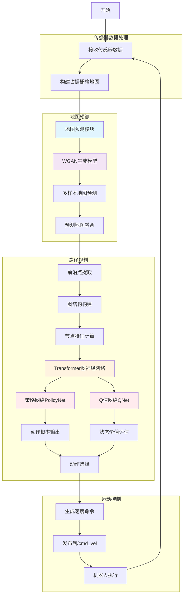

# CogniPlan ROS Package

A ROS implementation of the CogniPlan navigation system that integrates trained deep reinforcement learning models for robot path planning in unknown environments.

## Algorithm Flow



## Package Structure

```
cogniplan/
├── package.xml
├── CMakeLists.txt
├── README.md
├── requirements.txt
├── setup.py
├── launch/
│   └── cogniplan_planner.launch
├── config/
│   └── cogniplan_planner.yaml
├── msg/
│   └── CogniPlanStatus.msg
├── srv/
│   └── SetGoal.srv
├── planner/
│   ├── __init__.py
│   ├── cogniplan_planner_node.py
│   ├── agent.py
│   ├── driver.py
│   ├── env.py
│   ├── model.py
│   ├── node_manager.py
│   ├── parameter.py
│   ├── quads.py
│   ├── runner.py
│   ├── sensor.py
│   ├── test_driver.py
│   ├── utils.py
│   └── worker.py
├── checkpoints/
│   └── cogniplan_exp_pred7_test/
└── dataset/
    └── [data files]
```

## Overview

CogniPlan is an advanced cognitive planning system that uses deep reinforcement learning and predictive mapping to navigate robots in unknown environments. This package provides a ROS node that integrates trained PolicyNet and QNet models with a WGAN-based map predictor, enabling intelligent exploration and path planning in dynamic environments.

## Features

- Integration with trained CogniPlan models (PolicyNet and QNet)
- WGAN-based predictive mapping for unknown environments
- Transformer graph neural network for spatial reasoning
- Subscribes to standard ROS topics:
  - `/map` (nav_msgs/OccupancyGrid)
  - `/scan` (sensor_msgs/LaserScan)
  - `/odom` (nav_msgs/Odometry)
- Publishes motion commands to `/cmd_vel` (geometry_msgs/Twist)
- Supports both CPU and GPU execution
- Implements safety constraints and emergency stopping
- Configurable parameters for maximum velocities and safety distances
- Custom ROS messages and services for enhanced system monitoring and control

## Dependencies

- ROS (Noetic or later recommended)
- Python 3.6+
- PyTorch 1.7+
- NumPy 1.19+

## Installation

1. Clone this repository to your ROS workspace:
   ```bash
   cd ~/catkin_ws/src
   git clone <repository-url> cogniplan
   ```

2. Install Python dependencies:
   ```bash
   pip install -r cogniplan/requirements.txt
   ```

3. Build the package:
   ```bash
   cd ~/catkin_ws
   catkin_make
   ```

## Building with Catkin Tools

```bash
# Build the package
catkin build cogniplan
```

## Usage

### Launch the planner node

```bash
roslaunch cogniplan cogniplan_planner.launch
```

### Custom Messages and Services

The package provides custom messages and services:

- `CogniPlanStatus.msg`: Status information from the planner including planning status, goal information, and robot state
- `SetGoal.srv`: Service to set a new goal pose for the planner

### Parameters

Parameters are configured in `config/cogniplan_planner.yaml`:

- `model_path`: Path to the trained model checkpoints (default: "checkpoints/cogniplan_exp_pred7_test")
- `use_gpu`: Whether to use GPU for inference (default: true)
- `max_linear_vel`: Maximum linear velocity (m/s) (default: 0.5)
- `max_angular_vel`: Maximum angular velocity (rad/s) (default: 1.0)
- `min_obstacle_distance`: Minimum distance to obstacles before stopping (m) (default: 0.5)
- `planning_horizon`: Number of steps to plan ahead (default: 10)
- `planning_frequency`: Planning frequency in Hz (default: 10)
- And many more configurable parameters...

## Model Files

The system expects the following model files in the checkpoints directory:
- `policy_net.pth`: Trained PolicyNet model
- `q_net.pth`: Trained QNet model
- `gen_X.pt`: Trained WGAN generator model for map prediction

## Node Details

### Subscribed Topics

- `/map` (nav_msgs/OccupancyGrid): Map data from SLAM or static map server
- `/scan` (sensor_msgs/LaserScan): Laser scan data from robot sensors
- `/odom` (nav_msgs/Odometry): Robot odometry data

### Published Topics

- `/cmd_vel` (geometry_msgs/Twist): Velocity commands for robot base controller
- Custom status topic with `CogniPlanStatus.msg` messages

### Services

- Custom `SetGoal.srv` service for setting new goals

## Safety Features

- Emergency stopping when obstacles are too close
- Velocity limiting based on configured maximum values
- Graceful handling of missing sensor data
- Configurable safety margins

## Contributing

Please submit issues and pull requests to the main repository.

## License

This project is licensed under the MIT License - see the LICENSE file for details.